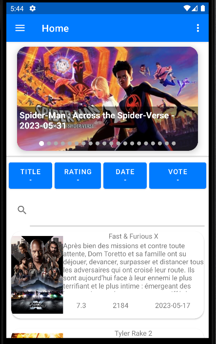
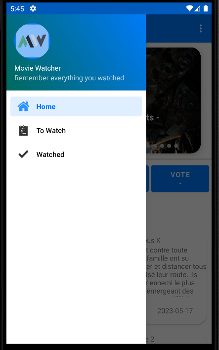
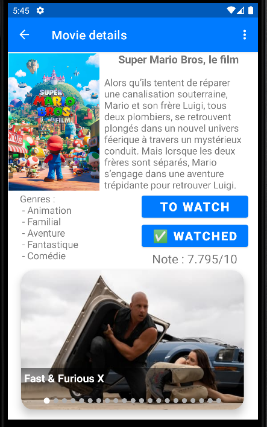
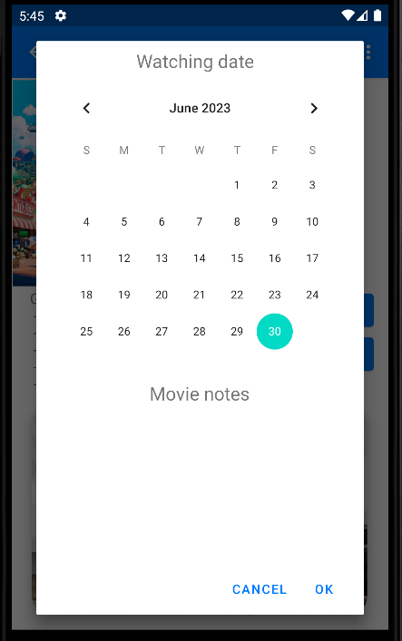
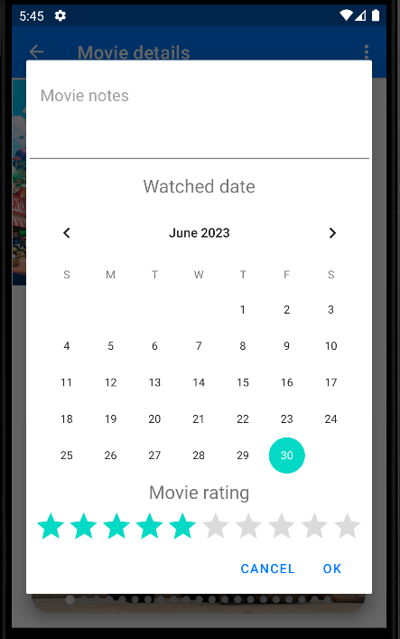
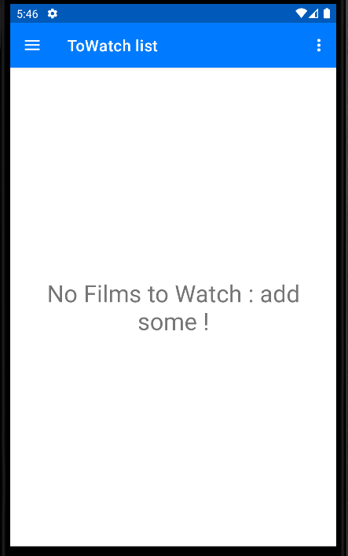
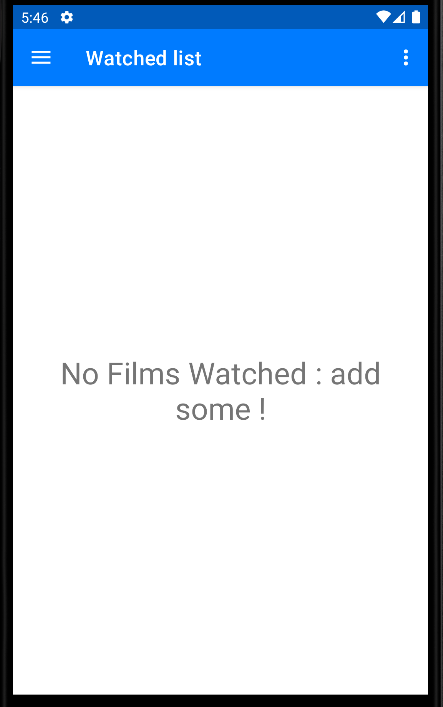
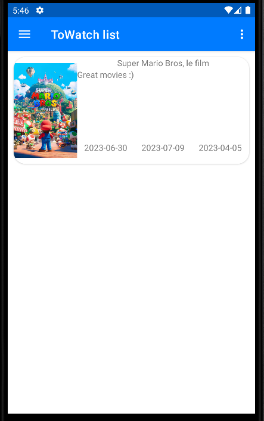
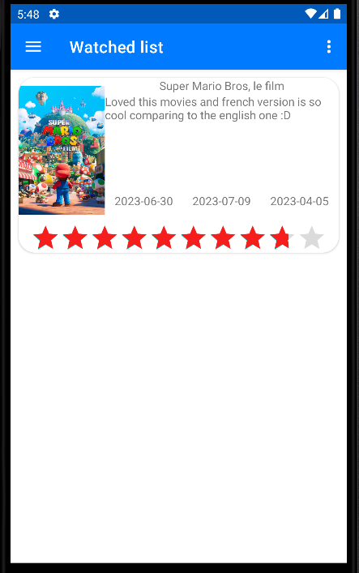

<div style="text-align: center;">
 <h2>
 Movie Watcher - An app for planning your watching sessions
 </h2>
 </br>
 <h3>
 Mathis Caisson
 </br>
 2023-06-30
 </h3>
</div>

# Movie Watcher

Movie watcher is an application for discovering what you want to watch. For this the applications will use the API of TMDB in order to get access to a consequent movie database. Thanks to movie watcher you'll be able to see in one sight what film are the more popular now, what films are now in cinemas, etc... Moreover you'll be able to search some films within the app and sort the films in specifical order to ease your search. With this app you'll grow your film knowledges by discovering films reading the synopsis, searching some new films and select some to watch. In this applications you'll be able to add some films to your watching list and specify a day when you want to watch the film. If you have some films to watch you'll receive a notificiation at 8 am so that you remember that you need the films you planned to watch. Then once you watched the movie you can transfer it to your watched list in order to remember every film you watched, you can put some notes and give a rating from 0 to 10. The principle advantage of this app is that everything is kept offline so that nobody except you knows what you watched and what you think about those films.

For now lets see a bit what the applications looks like, how can you use it and how it was made.

## How to use the application 

First when you'll open the application you will find the home page, this is the page that we can see on the screen underneath. This home page will be constituted of many elements : 
* A slider where appears all the films that are playing now in French cinemas
  * in each item of the slider you have a poster with the title of the movie and the release date
* A endless scroll movie list where appears at first the most popular movies 
  * in each item of the list you have an item where you can see the poster of the film, its title, the synopsis (that you can scroll), the average rating, the number of ratings and the release date.
* Four three state sort buttons in order to sort the list that you got, you can sort by title, rating, release date or number of ratings.
* A search bar where you can type the film you want to search like for example "One Piece" to have all the one piece movies.  


<center>

</center>


Then, by clicking on the three small lines on the left to corner you can make appear a drawer menu where there are 3 elements : 
* The home page
* The to watch page
* the watched page

Those pages will be 3 of 4 pages that you will have in the application. You can navigate thanks to this menu by clicking on the page you want to go, either the home page, the to watch list of the watched list.

<center>

</center>

However there is a fourth page, a page where you will be able to see the details of a specific movie. For accessing this page you just need to click on an item of the slider or list in the home page or an item the to watch list or watched list. Then you'll be redirected on another page where you'll have more informations on the movie : 
* On the top left corner you can see the poster of the film but larger
* Under the poster there are the genres of the movies 
* At right of the poster you have the title and synopsis
* At right of the genre you have the average rating
* Upside of the rating you have two big buttons to add the film to your "TO WATCH" list or to your "WATCHED" list.
* At the bottom you have a slider that shows every film that is somewhat similar to this movie.

<center>

</center>

This page is very important, especially because of the two big blue buttons. Those buttons will be usefull to add your movies to your to watch or watched list. When You click on one of the buttons it will do some checks to verify if you do not have this movie already in your list. If not then it will show a modal in order to add information to your adding. 

If you click on "TO WATCH" then you'll add to your to watch list and it will add it to the list if it is not in the to watch and watched list. The modal will have a calendar where you can indicate the date when you want to watch this movie in order to got a notification . You can also add some notes to display it in the list, if you don't add notes there will be the synopsis in the list.

<center>

</center> 

If you click on "WATCHED" then you'll add to your watched list and it will add it to the list if it is not in the watched list, if it is in the to watch list the movie will be transfered to be removed from to watch list. The modal will have a text field to add some notes about the watched movie, a calendar to indicate when you watched it and a rating bar to rate the film.

<center>

</center>

You can cancel or accept the adding, then depending on your choice it will be added or not to the list. If there is no film in your list either to watch or watched then there will be a message to say that you need to add some items in the list in order to see the list. 

<center>
  <div>
    
    
  </div>
</center>

If there is some items in your to watch list and you go on the good page then you'll see a list of item with like the home items : the poster, the title, the synopsis, the release date but also on the middle you'll have the date you added the item and at left the date when you want to watch the movie. When you click on it you'll access the detailled page of the movie.

<center>

</center>

If there is some items in your watched list and you go on the good page then you'll see a list of item with like the home items : the poster, the title, the synopsis, the release date but also on the middle you'll have the date you added the item and at left the date when you watched the movie. Moreover there will be also a rating bar to show what was your rating on this movie.

<center>

</center>

More over on both list you can do a long touch to display a modal, this modal will ask you if you want to remove the item from the list. Then if you accept the item will be removed from the list and you'll be able to add it again if you need. 

Finally there is a system of reminder for watching your movies. Every morning at 8 am you will receive a notification if you have some movies to watch today. If you click on the notification you'll go to the home page and then you can go to your to watch list in order to see what you need to watch today. Or you can just ignore the notification and watch the movie another day.

## How works the application

The application is divided in 3 main parts : 
- The `project code root folder` : This part will contains 2 files needed to run the main core of the project and 2 folders that are the 2 other main parts of the project.
  - **MainActivity.java** : This file will be the core of our project that will instanciate all the necessary so that our application can run. This part will instanciate the drawer menu, start the worker for notifications, display the main activity with a fragment manager to switch easily from a view to another with the drawer menu and the android navigation component.
  - **NotificationWorker** : This file is the code of a worker started in main activity. The worker will be started and the function `doWork()` will be called every morning at 8 am.

- The `lists folder` : This folder will contains will contains 3 other folders for containing our 3 dynamic lists code.
  - `HomeList folder` : This folder is the folder that contains all the code of our home list defining the different behavior or our list. This list is a paginable list, this means that we need to describe items but also loading behavior.
    - **HomeAdapter.java** : This file will define the behavior of the list by defining what's in the list, the interactions but also some utility function for our list like adding a loading item, define a sorting order, etc...
    - **HomeItem.java** : This file will define the HomeItem object so taht we can regroup variables into only one object that we can access and modify with getters and setters.
    - **HomeProgressViewHolder.java** : This file will define the instanciation of a loader in the list with the appropriate layout and data.
    - **HomeViewHolder.java** : This file is similar to the previous one but here it will describe the instanciation of an HomeItem in the list with approriate layout and data.
    - **LoadListener.java** : This file is use as an abstract class in order to redefine the scrollListener in our home fragment to trigger appropriate function when needed and create a pagination system.
  - `ToWatchList folder` : This folder will define the behavior of the to watch list so that the application knows how to display the list but also how to store the corresponding data. Here the code is a bit simpler for the list because there is no pagination system.
    - **ToWatchAdapter.java** : This will have the same objective as HomeAdapter.java but for our ToWatchList.
    - **ToWatchItem.java** : This will have the same objective as HomeItem.java but for our ToWatchList.  
    - **ToWatchViewHolder.java** : This will have the same objective as HomeViewHolder.java but for our ToWatchList.   
    - **ToWatchSQLiteHelper.java** : This file is defining how do we store our to watch items defining the columns in our SQLite scheme. This file define the creation and update process of the database used for our ToWatch list.
    - **ToWatchDataSource.java** : This file will define all the utility functions needed to make requests to our database scheme. It can be instanciated in order to have access to functions to make requests to our ToWatchSQLiteHelper object. This file will permit to our application to add movies in the list, delete movies from the list or search movies in the list.
  - `WatchedList folder` : This folder will define the behavior of the watched list so that the application just like the to watch list. The behavior is very similar and so the code is also very similar with the same files.
    - **WatchedAdapter.java**
    - **WatchedItem.java**
    - **WatchedViewHolder.java**
    - **WatchedSQLiteHelper.java** 
    - **WatchedDataSource.java**
- The `ui folder` : This folder will contains 4 other folders defining the 4 main views of the application. Those folders will define the fragments code of the four view and their behavior in order to display the diverse lists and datas.
  - `home folder` : This folder will contain the file **HomeFragment.java** defining the home page with every ui interactions and linking all the home components together in one window.
  - `toWatch folder` : This folder will contain the file **ToWatchFragment.java** defining the to watch list displaying in a fragment the list of the films to watch linked with the component in the `lists folder`
  - `Watched folder` : This folder will contain the file **WatchedFragment.java** defining the watched list displaying in a fragment the list of the films watched linked with the component in the `lists folder`
  - `film_detailled folder` : This folder will contain three files, **AddToWatchDialog.java** and **AddWatchedDialog.java** thata are the two files that are defining the dialog behavior when you click on the buttons for adding on the to watch list or the watched list. THose two buttons are defined in the view showing the details of a film, this view behavior is defined with the third file **FilmDetailledFragment.java**.

Moreover there are some folders and files that are very useful to understand the project : 
- `drawable folder` : this is the folder containing our icons that appears in the drawer menu list.
- `mipmap folders` : those folders contains the application logo that is used for the icon of the app, in the drawer menu or for ou notifications
- `layout folder` : this is the folder containing all the xml files defining the different layouts for the differents views, dialogs, items, menu, etc ... Those files are defining the pure UI of our application.
- `menu folder` : this is the folder defining our drawer menu and the different items inside it.
- `navigation folder` : this is the folder defining the navigation component of our application. In this folder we have the file **mobile_navigation.xml** that is defining different actions to be executed in order to switch from one fragment to another in the fragment manager to permit to go from one view to another like for example when you click on a film in the list we will execute a action for going to the detailled fragment

Finally this application was made using external ressources liek libraries and API. Indeed this application is based on **The Movie Database**, an api that permits to our application to make requests in order to get access to a lot of movie. Our home list is only filled with the TMDB api datas, this is why you'll need an API key in order for compilling your own version of this application. For obtaining an API key you can follow the instructions on the following website : [TMDB](https://developer.themoviedb.org/docs). Then once you have your API key you need to put it in the file **gradle.properties** by adding the following lines at the end of the file : 
```
# API key for TMDB
TMDB_API_KEY="<YOUR_API_KEY>"
```

Moreover for this applications we used a lot of libraries in order to do some complex operations rapidly. All the libraries are defined in the **build.gradle** file in the `app folder` but i will cite here the major libraries used for the application : 
- **androidx.work:work-runtime:2.8.1** : A package from google jetpack in order to create workers, those workers will remains even when the application is closed or the phone is rebooted. On this application we used workers for triggering notifications.
- **com.squareup.picasso:picasso:2.71828** : A package used for loading images ressources from url. This package was used to load every film poster from a TMDB url in the phone cache to be used when necessary.
- **com.github.denzcoskun:ImageSlideshow:0.1.2** : A package used for creating slideshow quickly. Those slideshows are displayed on the main menu with TMDB content and in the detailled film view. This permits to create easily a beautiful component.
- **com.android.volley:volley:1.2.1** : A package used for doing asynchroneous requests. This is the package used for doing the requests to the TMDB api with a given URL so that we can asynchroneously receive a response. THis package was the most useful in this app cause it permits to do some quick requests without creating tons of services.

  
## How the project was made

For this project i needed to have a good methodology. Indeed, android applications are difficults because there are a lot of components. It can be sometimes hard to know what to do, where and when. This is why, even if i was alone on this project, i decided to work with a Kanban approach. I first defined the different tasks to do like for example, make a menu, to a simple list of item, add an item, define a database, etc ... Then i classified those tasks by priority order. Then when i was working on it i just had to work on a specific task and add this task on the "on progess" side. This method was helping me a lot cause i knew where i was everytime i develloped this application, then i could adapt myself on the work i needed to do. Then once i finished the task, i checked the task and took another one. Moreover during all this project, i used github in order to do a versionning of my project but also to classify my advancements into commits. Once i did a specific tasks, i commited so that if there was a problem i could rollback and not lost every code i wrote. However even if i used github, because i was alone, i decided to work only on the main branch wich is not the best idea but for a project alone it was good enough cause i was not conflicting with myself.

## How to improve the application

Even if the application in functionnal, there is still a lot to do on it. I wanted to do many things on this applications but because of the lack of time, i decided to skip some features. Those feature can be added in the future. For this i will put the remaining tasks of my kanban : 
- [ ] Personalize the daily notification with the movie you need to watch
- [ ] Change the background color in the to watch list depending if the date you wanted to watch is in a long time or already exceeded
- [ ] Put settings in order to activate or not R18 content.
- [ ] Put settings in order to change the country for TMDB request
- [ ] Add translations in strings.xml and make the translations changes depending on the settings
- [ ] Import or export the to watch or watched list in order to permit data transfer when changing phone
- [ ] Link automatically the watched movies with the plex API so that when you watch a movie on plex it is automatically added in your watched list
- [ ] When long clicking on an item give the choice between deleting or changing the content of the item.
- [ ] Implement double direction pagination so that when you come back to home page you can recover the good slot in the list in a specific window and permit to load back the top content when sliding up.
- [ ] Add layouts for other phones and screen to permit to use the application in landscape or with a tablet
- [ ] ... 

As we can see there is still a lot to do. However for now the application is working properly and can still be used with the basic features, other features can be added through future updates.

## How was tested the application

The application was tested manually on two different phones with two different android API in order to reduce the probability of a false negative.

- Physical device : *Xiaomi M2007J20CG - Android 10.0 - API 29*
- Virtual device : *Google Pixel 2 - Android 11.0 - API 30*


